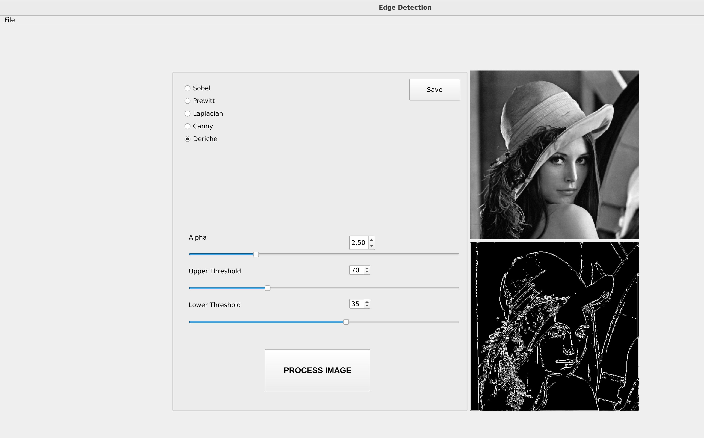

# Edge Detection Methods with Qt GUI

This C++ project, developed with the Qt library, provides a graphical user interface (GUI) for various edge detection methods. The implemented methods include:

1. **Sobel Operator:**
   - Utilizes convolution with Sobel kernels to highlight edges in both horizontal and vertical directions.

 | 
:---: | :---:
*Original Image* | *Image After Sobel Edge Detection*

2. **Prewitt Operator:**
   - Similar to Sobel but uses a different convolution kernel to emphasize edges.
  
 | 
:---: | :---:
*Original Image* | *Image After Prewitt Edge Detection*

1. **Laplacian Operator:**
   - Involves the use of a Laplacian kernel to identify regions with rapid intensity changes, indicating potential edges.
  
 | 
:---: | :---:
*Original Image* | *Image After Laplacian Edge Detection*

1. **Canny Edge Detector:**
   - A multi-stage algorithm involving smoothing, gradient computation, non-maximum suppression, and edge tracking by hysteresis.

 | 
:---: | :---:
*Original Image* | *Image After Canny Edge Detection*

5. **Deriche Edge Detector:**
   - It is a multi-step algorithm employed to achieve optimal results in detecting edges within a discrete two-dimensional image.

 | 
:---: | :---:
*Original Image* | *Image After Deriche Edge Detection*

## Graphical User Interface (GUI)
The graphical user interface (GUI) for this project is implemented using the Qt library. An overview of the GUI is presented in the figure below.

|  |
|:---:|
| *Graphical User Interface* | 

The user is required to initiate the process by opening an image (supported formats: .jpeg, .jpg, .png) using the file action button located in the upper-left corner. The selected image will then be displayed in the upper-right section of the screen.

Next, the user can choose a specific edge detection method by clicking on the corresponding option. The processed image will be presented in the lower-right area of the screen. For the Canny and Deriche methods, users have the flexibility to adjust parameter values using either sliders or input boxes. To visualize the impact of parameter changes, the user needs to click the "Process Image" button.

Additionally, users can utilize the "Save" button to store the processed image in their preferred directory.

Qt version: 6.6.1

One can also find an executable file for linux OS inside build folder.

## Usage

To use the edge detection methods with the GUI implemented in this Qt project, follow these steps:

1. Clone the repository:

   ```bash
   git clone git@github.com:mugorunen/Edge_Detection_Methods.git
2. In your local directory, navigate to the 'build' directory and build the project:
   
   ```bash
   cd build
   cmake ..
   make
3. Run executable file:
   ```bash
   ./executable-file-name
